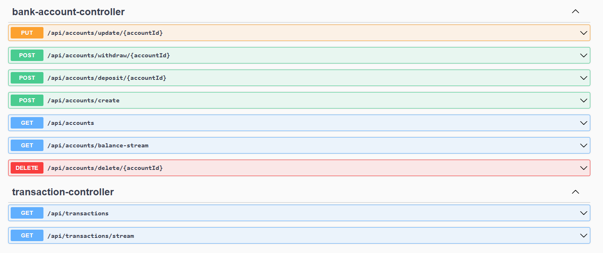

## Description

This project is an application for managing bank accounts and transactions using reactive programming in Spring. The main objective is to learn and implement reactivity with Java and MongoDB Reactive.

The application provides functionality for creating and managing bank accounts, performing transactions, and observing real-time data updates.

The database is a MongoDB reactive database named `bankAccount`.

## Database Collections

The application uses two main collections: `accounts` and `transactions`. Below are the details of the collections and their fields.

### 1. **Accounts Collection**

This collection stores information about the bank accounts.

| Field Name         | Type          | Description                                      |
|--------------------|---------------|--------------------------------------------------|
| `id`               | UUID          | Unique identifier for the bank account.         |
| `numberAccount`    | String        | Unique account number.                          |
| `balance`          | Double        | Current balance in the bank account.            |
| `type`             | String        | Type of the bank account (e.g., Savings, Checking). |

### 2. **Transactions Collection**

This collection stores information about transactions associated with bank accounts.

| Field Name         | Type          | Description                                      |
|--------------------|---------------|--------------------------------------------------|
| `id`               | UUID          | Unique identifier for the transaction.          |
| `accountId`        | UUID          | Identifier of the associated bank account.       |
| `numberAccount`    | String        | Number of the associated bank account.          |
| `type`             | String        | Type of transaction (e.g., Deposit, Withdrawal). |
| `amount`           | Double        | Amount of the transaction.                      |
| `previousBalance`  | Double        | Balance before the transaction.                 |
| `currentBalance`   | Double        | Balance after the transaction.                  |
| `transactionDate`  | LocalDateTime | Date and time of the transaction.               |

### 3. **Relationship Between Accounts and Transactions**

- The `Transaction` collection has a **Many-to-One** relationship with the `Account` collection.
- Each account can have multiple transactions, but each transaction is associated with exactly one account.

#### Entity Relationship Diagram (ERD)

- **Account (1) --- (Many) Transaction**

This means that an account can have multiple transactions, but each transaction can only be associated with one account.

## Project Structure

The project is divided into the following layers:

### Models
Models represent the main objects of the system, which correspond to the database collections.

- Route: [BankAccount.java](src/main/java/com/reactive/audit/model/BankAccount.java)
- Route: [Transaction.java](src/main/java/com/reactive/audit/model/Transaction.java)

### Repositories
Repositories provide the database access interface for system entities.

- Route: [BankAccountReactiveRepository.java](src/main/java/com/reactive/audit/repositories/BankAccountReactiveRepository.java)
- Route: [TransactionReactiveRepository.java](src/main/java/com/reactive/audit/repositories/TransactionReactiveRepository.java)

### DTO (Data Transfer Objects)
DTOs are used to transfer data between different layers of the application. They include validation annotations to ensure data integrity. Bean Validation (javax.validation) is used for validations.

#### Request DTOs

1. **BankAccountRequestDTO**

- Route: [BankAccountRequestDTO.java](src/main/java/com/reactive/audit/DTO/req/BankAccountRequestDTO.java)

| Field Name      | Validation                                                                                     | Description                                      |
|-----------------|-----------------------------------------------------------------------------------------------|--------------------------------------------------|
| `numberAccount` | @NotBlank(message = "The account number cannot be empty."), @Size(min = 10, max = 20)       | Unique account number.                          |
| `balance`       | @PositiveOrZero(message = "The balance must be zero or positive.")                           | Initial balance of the account.                |
| `type`          | @NotBlank, @Pattern(regexp = "SAVINGS|CHECKING", message = "Must be SAVINGS or CHECKING.") | Type of account (Savings or Checking).          |

2. **TransactionRequestDTO**

- Route: [TransactionRequestDTO.java](src/main/java/com/reactive/audit/DTO/req/TransactionRequestDTO.java)

| Field Name         | Validation                                                                                       | Description                                      |
|--------------------|-------------------------------------------------------------------------------------------------|--------------------------------------------------|
| `accountId`        | @NotNull(message = "Account ID cannot be null.")                                               | Identifier of the associated account.           |
| `numberAccount`    | @NotBlank, @Size(min = 10, max = 20)                                                            | Account number associated with the transaction. |
| `type`             | @NotBlank, @Pattern(regexp = "DEPOSIT|WITHDRAWAL", message = "Must be DEPOSIT or WITHDRAWAL.") | Type of transaction.                            |
| `amount`           | @Positive(message = "Amount must be greater than 0.")                                          | Transaction amount.                             |
| `previousBalance`  | @NotNull, @PositiveOrZero                                                                       | Balance before the transaction.                 |
| `currentBalance`   | @NotNull, @PositiveOrZero                                                                       | Balance after the transaction.                  |

#### Response DTOs

1. **BankAccountResponseDTO**

- Route: [BankAccountResponseDTO.java](src/main/java/com/reactive/audit/DTO/res/BankAccountResponseDTO.java)

- Fields:
    - `success`: Indicates if the operation was successful.
    - `message`: Describes the outcome of the operation.
    - `data`: Contains additional information or the result.

- Example:
  ```json
  {
      "success": true,
      "message": "Account created successfully.",
      "data": {
          "id": "123e4567-e89b-12d3-a456-426614174000",
          "numberAccount": "1234567890",
          "balance": 1000.0,
          "type": "SAVINGS"
      }
  }
  ```

2. **TransactionResponseDTO**

- Route: [TransactionResponseDTO.java](src/main/java/com/reactive/audit/DTO/res/TransactionResponseDTO.java)

- Fields:
    - `success`: Indicates if the operation was successful.
    - `message`: Describes the outcome of the operation.
    - `data`: Contains additional information or the result.

- Example:
  ```json
  {
      "success": true,
      "message": "Transaction completed successfully.",
      "data": {
          "id": "123e4567-e89b-12d3-a456-426614174001",
          "numberAccount": "1234567890",
          "type": "DEPOSIT",
          "amount": 500.0,
          "previousBalance": 1000.0,
          "currentBalance": 1500.0,
          "transactionDate": "2025-01-16T10:00:00"
      }
  }
  ```

### Services
Services contain the business logic to handle operations on entities.

#### BankAccountService

- Route: [BankAccountService.java](src/main/java/com/reactive/audit/services/accounts/BankAccountService.java)
- Route: [BankAccountServiceImpl.java](src/main/java/com/reactive/audit/services/accounts/BankAccountServiceImpl.java)

- **Interface:**
    - `streamBalanceByAccountNumber(String numberAccount)`: Streams the balance of a specific account.
    - `getAllAccounts()`: Retrieves all accounts.
    - `createAccount(BankAccountRequestDTO requestDTO)`: Creates a new account.
    - `updateAccount(UUID accountId, BankAccountRequestDTO requestDTO)`: Updates an existing account.
    - `deleteAccount(UUID accountId)`: Deletes an account.
    - `depositMoney(UUID accountId, double amount)`: Deposits money into an account.
    - `withdrawMoney(UUID accountId, double amount)`: Withdraws money from an account.

- **Implementation Highlights:**
    - Validates deposit and withdrawal amounts.
    - Updates account balances and creates associated transactions.
    - Returns success or error responses as `BankAccountResponseDTO`.

#### TransactionService

- Route: [TransactionService.java](src/main/java/com/reactive/audit/services/transactions/TransactionService.java)
- Route: [TransactionServiceImpl.java](src/main/java/com/reactive/audit/services/transactions/TransactionServiceImpl.java)
- **Interface:**
    - `getAllTransactions()`: Retrieves all transactions.
    - `streamTransactions(String numberAccount)`: Streams transactions of a specific account.
    - `createTransaction(TransactionRequestDTO requestDTO)`: Creates a new transaction.

- **Implementation Highlights:**
    - Creates transactions with accurate timestamps and balances.
    - Streams real-time transaction updates using MongoDB tailable cursors.

### Controllers
Controllers handle HTTP requests and map them to service methods. They also define API endpoints for interaction.

#### BankAccountController
- Route: [BankAccountController.java](src/main/java/com/reactive/audit/controllers/BankAccountController.java)
- **Endpoints:**
    - `GET /api/accounts/balance-stream`: Streams the balance of a specific account in real time.
    - `GET /api/accounts`: Retrieves all accounts.
    - `POST /api/accounts/create`: Creates a new account.
    - `PUT /api/accounts/update/{accountId}`: Updates an existing account.
    - `DELETE /api/accounts/delete/{accountId}`: Deletes an account.
    - `POST /api/accounts/deposit/{accountId}`: Deposits money into an account.
    - `POST /api/accounts/withdraw/{accountId}`: Withdraws money from an account.

#### TransactionController
- Route: [TransactionController.java](src/main/java/com/reactive/audit/controllers/TransactionController.java)
- **Endpoints:**
    - `GET /api/transactions`: Retrieves all transactions.
    - `GET /api/transactions/stream`: Streams transactions of a specific account in real time.

### API Documentation with Swagger

To test and explore the available endpoints, the project uses **Swagger** for API documentation. Swagger provides an interactive UI to visualize and interact with the API.

- The Swagger UI is accessible at: `http://localhost:8085/webjars/swagger-ui/index.html`.
- It provides detailed information about each endpoint, including request and response structures.

#### Example Swagger Documentation



By using Swagger, developers and testers can easily verify the functionality and correctness of the API without needing additional tools.
